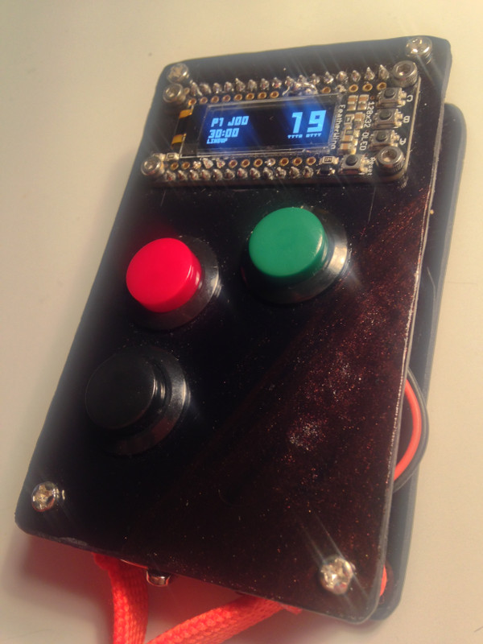

# CounterClock

This is the software for a stop watch designed for roller derby jam timing. It's made out of an arduino with a 128×32 OLED display.

If there's enough interest, i'll produce a small batch of CounterClocks, so let me know.

If you like this project, please consider supporting my League, [Bear City Roller Derby](http://bearcityrollerderby.com/en/)

Pull requests welcome.

## Used Libraries

* [Adafruit_GFX](https://github.com/adafruit/Adafruit-GFX-Library)
* [Adafruit_SSD1306](https://github.com/adafruit/Adafruit_SSD1306)
* [Adafruit_FeatherOLED](https://github.com/adafruit/Adafruit_FeatherOLED)
* [ESP8266WiFi](https://github.com/esp8266/Arduino/) (If you use the Adafruit Feather HUZZAH)

## Prototype

Yes, it's crooked and rough, but it works like a charm.

## Interface

In the top left corner, Jam and Period number are indicated.
Below the period clock is shown.
In the left bottom, the current state is displayed.

On the right bottom, symbols indicate remaining Team Timeouts and Official Reviews.
And the big clock on the right shows the clock for Jam, Lineup, Timeout and Halftime.

## Usage

There are three buttons: Button A (Green), Button B (Red) and Button C (Black).
There#s also a vibrating motor, giving some haptic feedback.

After switching the device on, the game is started by pressing any button. The game starts in Lineup Mode.

### Lineup

In Lineup Mode the timer is set to 30 Seconds and will count down to 0. At 0 the device switches to Jam Mode automatically and resumes the Period Clock if stopped.

At five seconds the device will buzz.
At four to one seconds, the device will do a short buzz every second.
At zero seconds, when the jam starts, the device will do a long buzz.

Pressing Button A will start the jam immediately and the device will switch to Jam Mode.

When the Period Clock ist stopped (after a timeout or in the beginning of a period), pressing Button B will set the Lineup Clock to 5 seconds immediately.

Pressing Button C will start a timeout and the device will switch to Timeout Mode.

When the Period Clock is at 00:00, the device will switch to Halftime or End of Game Mode.

### Jamming

In Jam Mode, the timer is set to 2:00 and will count down to 0. The last 5 seconds will be indicated by a short buzz every second. 
At 0 the Jam ends and the devices switches back to Lineup Mode.

Pressing Button A or B will call off the jam immediately and the device will switch to Lineup Mode, when the Jam is on for at least 3 seconds.

Pressing Button C will start a timeout and the device will switch to Timeout Mode.
When Button C is pressed within the first three seconds, it is assumed the Timeout was called during Lineup and the Jam wasn't started.

### Timeout

In Timeout mode, the Period Clock is stopped.

Every Timeout starts as an Official Timeout. Pressing Button C cycles through Timeout and Adjust Modes.

#### Official Timeout

Pressing Button A will end the official Timeout and the device will switch to Lineup Mode.

#### Team Timeout

A Team Timeout will end autmatically at 60 seconds and the device will switch to Lineup Mode.

Pressing Button A will decrease the number of Team Timeouts shown on the right.
Pressing Button B will decrease the number of Team Timeouts shown on the left.

When the Timeout Clock passes 60 seconds while not in Team Timeout Mode, pressing button A will end the Timeout in Team Timeout Mode.

#### Official Review

Pressing Button A will mark the Official Review Icon shown on the right.
Pressing Button B will mark the Official Review Icon shown on the left.

A buzz will indicate the one minute mark in Official Review mode.

After one minute, Pressing Button A or B will end the Official Review. While Button A will retain the Review Icon, Button B will delete it.
Ending the Timeout in any other mode will always retain the review.

#### Clock Adjust

Pressing Button A will increase the number of Seconds or Minutes on the Period Clock.
Pressing Button A will decrease the number of Seconds or Minutes on the Period Clock.

#### Jam Adjust

Pressing Button A will increase the number of Jams.
Pressing Button A will decrease the number of Jams.

### Halftime

The Halftime will not end automatically. 
Pressing Button A or B will end the Halftime and start a new Period. Official Reviews will be restored and the device will switch to Lineup Mode.

Pressing Button C will reset the Halftime Clock, start a timeout and the device will switch to Timeout Mode. This is useful when someone uses their Official Review after the last Jam.

### End of Game

Pressing Button B will initiate an overtime Jam. The Lineup Clock will be set to 60 seconds and the device will switch to Lineup Mode. 

Pressing Button C will start a timeout and the device will switch to Timeout Mode. This is useful when someone uses their Official Review after the last Jam.

## Parts list

Those are the parts i used for my prototype.

* [Adafruit Feather HUZZAH with ESP8266 WiFi](https://www.adafruit.com/products/2821)
* [Adafruit FeatherWing OLED](https://www.adafruit.com/products/2900)
* [Vibrating Mini Motor Disc](https://www.adafruit.com/products/1201)
* [16mm Panel Mount Momentary Pushbutton](https://www.adafruit.com/products/1445) Black, Red, Green
* [250 mAh LiPo Battery](https://www.adafruit.com/categories/917)
* Some Pin Headers

And for the Casing

* Some Scrap 3mm Plexiglass
* 4× 15mm M3 Spacers ans Screws
* 4× 18mm M2.5 Hex Bolts and Nuts
* A leftover lanyard

Tools and Materials

* Soldering iron and tin solder
* Screwdriver and Plyers
* Drill tool
* Glue and Velcro

## Case Template

In case you want to recreate my prototype, you 

## Future Plans

* Source a nice case
* Make the device communicate with scoreboard software

## License

The Font is based on Tom Thumb and Licensed under a 3-clause BDS license.
Everythin else is released [into the public domain](http://unlicense.org/).
