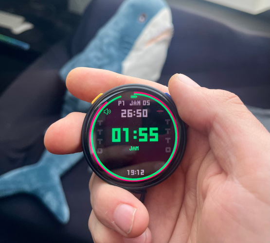
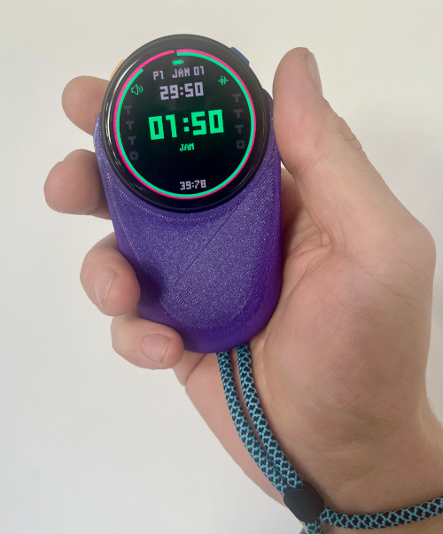
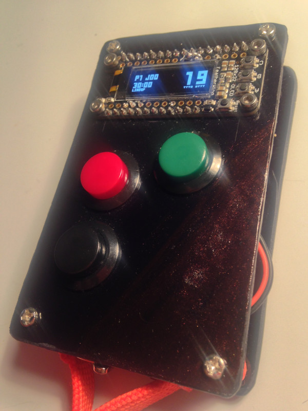

# CounterClock for M5Stack StopWatch

This is the software for a stop watch designed for Roller Derby Jam Timing.
It's made to run on an [M5Stack StopWatch](https://docs.m5stack.com/en/core/StopWatch) ([Shop](https://shop.m5stack.com/products/m5stack-stopwatch-dev-kit-esp32-s3), [AliExpress](https://de.aliexpress.com/item/1005012345507286.html))



## Manual

*A comprehensive manual is planned*

### Buttons

#### Bottom Button (Red)

When the device is off, pressing the button once will turn the device on.
When the device is on, pressing the button twice will completely turn the device off, including the real time clock.

> [!CAUTION]
> To keep the real time clock ticking, set the device to sleep instead of fully powering it off.
> Turning the device off or setting it to sleep will reset the current game state.

#### Right Button (Blue)

The right button always executes the next logical step in the game

* At the Start: Start the first Lineup
* During Lineup:
	* When the Period Clock is stopped: Go to 5 Seconds, Press again to start the Jam
	* Otherwise: Immediately start the Jam
* During Jam: Immediately end the Jam
* During Official Timeout and Offical Review: End the Timeout and move to LineUp
* During Halftime: Start the next period
* At the End: Start a new Game

#### Left Button (Yellow)

The left button starts a Timeout during Jam and Lineup
During a Timeout, the left button switches between Official Timeout, Team Timeout and Official Review modes.

Holding the left button for 3 seconds will turn the device to sleep. This will reset the current game state, but keep the real time clock ticking.

### Touch Controls

* During Lineup, a Button to go to 5 Seconds immediately is available if the Period Clock is stopped. This can also be achieved by downwards swipe on the screen
* At the end of the game, a Button to start an Overtime Jam is available
* During timeout
	* Holding the `T` icons will switch the mode to Team Timeout and mark a timeout for the corresponding team
	* Holding the `O` icon will switch the mode Official Review and mark the Review for the corresponding team. Holding the icon again will mark the Review as retained.
	* Holding the Period Clock time will open an interface to adjust it
	* Holding the Perdiod and Jam number will open an interface to adjust them
	* Holding the Real Time clock will open an interface to change it
* Vibration / Sound signals can be toggled by holding their respective icons

### Automatic Actions

* Jam and Period numbers are incremented at the start of the Jam or Period
* When the Lineup clock has run down, the next Jam will start
* When the Jam clock has run down, the Jam will end
* A Team Timeout will end after a 60 seconds and start a new Lineup
* The Period clock will immediately stop at a Timeout
* The Period clock will resume if stopped at the start of a Jam
* The Period clock will resume after an Official Timeout when there are less than 30 seconds on the Period Clock ([WFTDA Officiating Procedures 3.2.2](https://static.wftda.com/officiating/wftda-officiating-procedures.pdf))

### Safety Locks

* A jam can not be called off in the first three seconds to prevent immediate call-offs by double pressing the button.
* A jam can not be started during the first second of the Lineup for the same reason.
* A Team Timeout ~or Official Review~ can not be ended for 60 seconds.
* An Overtime Jam can not be called off manually. It's still possible to call a Timeout during an Overtime Jam.

### Signals

The Stopwatch provides signals the Jam timer in the form of tones and vibrations resembling the appropriate whistle signals.
These can be individually toggled on and off by holding the corresponding icons on the screen.

Additionally there are some convenient time warning signals:

* Lineup: Signal at 6 Seconds and every Second until the Jam starts (For 5 Secons warnings)
* Timeout: Signal after 50 Seconds (For 10 Second Warnings)
* Jam: Signal at 5 Seconds (For Jam Calloff)

### Differences to the Officiating Procedures and Scoreboard

* Lineup Clock counts down instead of up. (It is never stated explicitly, but assumed in [WFTDA Officiating Procedures 2.7 and 6.1.1](https://static.wftda.com/officiating/wftda-officiating-procedures.pdf))
* Timeout is followed by a Lineup instead of the timeout clock continuing until the Jam starts. ([WFTDA Officiating Procedures 4.8](https://static.wftda.com/officiating/wftda-officiating-procedures.pdf) mandates this for the Scoreboard)

## Install

Using [Arduino IDE](https://arduino-ide.org/download.html) follow [these setup instructions](https://docs.m5stack.com/en/arduino/stopwatch/program) for the M5 Board

* M5Stack Board Manager version 3.3.7 or newer
* M5Unified 0.2.15 or newer
* M5PM1 1.0.7 or newer
* M5GFX 0.2.21 or newer

Select the `M5StopWatch` board and upload `counterclock.ino`.
The sketches containing folder must be named `counterclock`, matching the primary `.ino` file.

Alternatively, compile and upload from a terminal with:

```sh
./fla.sh
```

Pass `--port /dev/...` if the serial port is not detected automatically.

## Additional Resources

* [3D printable case](https://www.printables.com/model/1747065-m5stack-stopwatch-magnetic-grip-case)




## Todo

* [x] Hold Buttons to Rapidly cycle through Numbers
* [x] ~Figure out why Real Time Clock is not preserved~ no rtc battery, implement sleep
* [x] Sleep mode
* [x] Make 5 Seconds accessible via Button
* [ ] Visual Indicator of Touch Targets in Timeout Mode
* [ ] Improve Settings Overlay Positioning
* [ ] Write Manual
* [ ] Make Demonstration Video

## Future Plans

* Wifi Integration with [CRG Scoreboard](https://github.com/rollerderby/scoreboard)
	* Period Clock Sync (Manual and Automatic)
	* Game State Sync
	* Full Remote Control (For Scrimmage Situations without Scoreboard Operator)

## Contributions

Contributions are welcome! If you want to improve something or fix a bug:

* Fork the repository
* Create a new branch
* Commit your changes with a clear message
* Open a Pull Request

Please keep the PR focused on a single topic. If you're unsure about something, feel free to open an issue first to discuss it. Thanks!

You can find open tasks under issues or in the [todo section](#Todo)

Please follow the existing formatting conventions. The project uses tabs.

By contributing, you agree that your code will be dedicated to the Public Domain.

## Code of Conduct

This project follows the Contributor Covenant Code of Conduct. By participating, you are expected to uphold this code.

See the full text in the [code of conduct file](code-of-conduct.md).

## Name and History



CounterClock is called CounterClock because Roller Derby is played in counter-clockwise direction.
The first prototype of this software was released in 2016 and has been used successfully in many games.

## License

The CounterClock Font is based on [Tom Thumb](https://robey.lag.net/2010/01/23/tiny-monospace-font.html) ([CC-0](https://creativecommons.org/publicdomain/zero/1.0/)).
The CounterClock Software is [dedicated to the public domain](http://unlicense.org/).
